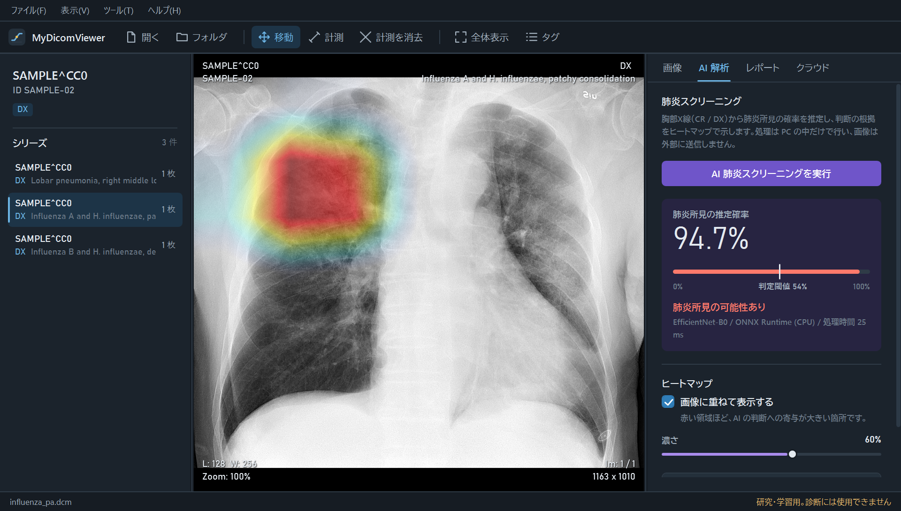

# MyDicomViewer — AI 搭載 DICOM ビューア & クラウド PACS

医用画像の標準規格 DICOM を表示・管理する Windows デスクトップアプリです。
PC 内で動く AI による胸部X線の肺炎スクリーニング、読影ソフトと同じ操作感のビューア機能、匿名化したうえでのクラウド保存を備え、インストーラーと自動更新で配布できます。

> ⚠️ 本アプリは学習・ポートフォリオ目的で作成したものです。医療機器ではなく、診断に使用することはできません。



*学習に使っていない公開画像（インフルエンザと H. influenzae による肺炎、主に右上葉の斑状浸潤影）に対して、肺炎所見の確率を推定し、AI が注目した領域を Grad-CAM で重ねて表示した例。ヒートマップは、医師の記載にある右上葉（画像の左上）に出ています。画像: Mikael Häggström, M.D.（[Wikimedia Commons](https://commons.wikimedia.org/wiki/File:Chest_radiograph_in_influensa_and_H_influenzae,_posteroanterior.jpg)、CC0）*

## 主な機能

| 分類 | 機能 |
|---|---|
| ビューア | ファイル・フォルダ・ドラッグ＆ドロップで読み込み、シリーズごとに撮影順で表示 / ホイールでスライス送り、カーソル位置を中心に拡大、右ドラッグで濃度調整 / CT の濃度プリセット / 画像の四隅に患者・検査情報 / DICOM タグ一覧と検索 |
| 計測 | DICOM の画素間隔を使った距離計測（mm）。X線で拡大率補正前の値しか無い場合は区別して表示 |
| オンデバイス AI | 胸部X線の肺炎所見の確率を ONNX Runtime で推定（CPU で約 0.05 秒）。根拠を Grad-CAM ヒートマップで表示し、結果を DICOM（二次取込画像）として保存 |
| クラウド | PS3.15 の基本プロファイルで匿名化してから Azure Blob Storage に保存し、Cosmos DB で検索・取得 |
| 生成 AI | 表示中の画像から GPT-4o mini で読影レポートのドラフトを生成（患者 ID は送信しない） |
| 配布・運用 | インストーラー、GitHub Releases からの自動更新、設定画面（キーは Windows のユーザーごとに暗号化）、初回起動時の注意事項への同意、ログ出力 |

## AI モデルの評価

RSNA Pneumonia Detection Challenge のデータを患者単位で分割し、学習にも閾値の決定にも使っていないテストデータ（2,669 人）で、アプリに組み込んだ ONNX モデルそのものを評価しました。

| 指標 | 値 |
|---|---|
| AUC | **0.884**（95% 信頼区間 0.870–0.898） |
| 感度 / 特異度 | 82.4% / 77.2% |
| 陽性的中率 / 陰性的中率 | 51.2% / 93.8% |
| ヒートマップの最大点が病変の枠内にある割合（Pointing Game） | **73.2%**（偶然の場合 11.8%） |
| 推論時間（CPU） | 約 43 ms / 枚 |

用途・学習データ・評価方法・既知の限界は [モデルカード](docs/MODEL_CARD.md) にまとめています。

## 設計

```
MyDicomViewer/
├─ MyDicomViewer/          WPF アプリ（画面のみ。MVVM）
│  ├─ ViewModels/          画面の状態と操作（MainViewModel）
│  ├─ Views/               画像表示（ズーム・計測）、タグ一覧、設定、初回ガイド、バージョン情報
│  ├─ Services/            ダイアログ、画像変換、更新、アプリ全体の操作
│  └─ Infrastructure/      ログ、ユーザー設定の暗号化保存
├─ MyDicomViewer.Core/     画面に依存しない処理（単体テストの対象）
│  ├─ Ai/                  前処理、ONNX 推論、結果の DICOM 書き出し
│  ├─ Dicom/               匿名化、シリーズ分け、タグ一覧、画素間隔
│  ├─ Imaging/             正規化・リサイズ・ウィンドウ処理、ヒートマップ
│  ├─ Cloud/ Reports/      Azure 連携、生成 AI レポート
│  └─ Configuration/       設定の読み込み（ファイル → ユーザー設定 → 環境変数）
├─ MyDicomViewer.Tests/    xUnit による単体テスト
├─ pneumonia-ai/           AI モデルの学習・ONNX 変換・評価（Python / Kaggle）
└─ docs/                   モデルカード、スクリーンショット
```

### 工夫した点

- **医療画像を外に出さない AI**: 肺炎スクリーニングは PC 内で完結させ、画像を外部サーバーに送らない
- **Grad-CAM をモデルに組み込む**: EfficientNet の末尾（Global Average Pooling → 全結合1層）の構造を利用すると Grad-CAM は勾配計算なしで求まるため、ONNX のグラフに組み込み、1回の推論で確率とヒートマップを同時に得る
- **学習と推論で前処理を完全に一致**: 正規化・縮小・丸め方まで Python と C# で同じ手順にし、単体テストで確認。ONNX での評価結果も学習時と一致
- **正直な評価**: 患者単位の分割、検証データでの閾値決定、信頼区間、判断根拠の位置の評価、限界の明記（モデルカード）
- **セキュリティとプライバシー**: 匿名化してからクラウドへ保存、キーはソースコードに書かず暗号化して保存、パラメーター化クエリ、患者情報をログや外部 AI に送らない、配布物にキーが紛れ込んだらビルドを止める
- **保守しやすい構成**: 処理を Core に分離して MVVM・依存性注入で組み立て、単体テストと GitHub Actions の CI で品質を確認

## インストール（利用者向け）

1. [最新のリリース](https://github.com/haru-ki417/MyDicomViewer/releases/latest) から `MyDicomViewer-win-Setup.exe` をダウンロードして実行（インストール不要の `MyDicomViewer-win-Portable.zip` もあります）
   - 署名していないため「Windows によって PC が保護されました」と表示された場合は、「詳細情報」→「実行」を選びます
2. 初回起動時に利用上の注意を確認して同意
3. [samples](samples/) の見本 DICOM（CC0 の公開画像から作成、患者情報なし）を「ファイル」→「開く」かドラッグ＆ドロップで表示
4. AI スクリーニングを使う場合は、メニューの「ツール」→「設定」で AI モデルのフォルダを指定（学習済みモデルは配布物に含めていません）
5. クラウド保存・AI レポートを使う場合は、同じ設定画面で Azure と OpenAI のキーを入力

新しい版は起動時に自動で確認されます（「ヘルプ」→「更新を確認」でも可能）。

## 開発

必要なもの: Windows、.NET 10 SDK、Visual Studio 2026（または Rider）

```powershell
# ビルドとテスト（結果は build.log にも保存）
powershell -ExecutionPolicy Bypass -File .\build.ps1

# インストーラーの作成（artifacts\releases に出力）
powershell -ExecutionPolicy Bypass -File .\tools\release.ps1
```

開発時のキーは `MyDicomViewer/appsettings.Local.example.json` をコピーした `appsettings.Local.json`（Git 管理外・配布物には含まれない）か、環境変数 `MYDICOMVIEWER_Azure__CosmosPrimaryKey` などで設定できます。

AI モデルの学習・評価の手順は [pneumonia-ai/README.md](pneumonia-ai/README.md) を参照してください。

## 今後の改善

- 複数施設のデータでの外部検証
- ヒートマップが肺野の外（腹部など）に反応することがあるため、肺野セグメンテーションと組み合わせて注目範囲を限定
- クラウド連携の認証を Microsoft Entra ID に移行し、キーを使わない構成にする
- 計測結果や注釈を DICOM の標準形式（GSPS / SR）で保存

## ライセンスと謝辞

このプロジェクトのソースコードは [MIT License](LICENSE) で公開しています。学習済みモデルの重みと、学習・評価に使った医用画像は含まれていません。

使用しているオープンソースソフトウェアは [THIRD_PARTY_NOTICES.md](THIRD_PARTY_NOTICES.md) を参照してください。

AI モデルの学習・評価には、Radiological Society of North America（RSNA）が主催した RSNA Pneumonia Detection Challenge のデータを、コンペのルールに従って使用しました。データ（画像・注釈）はこのリポジトリに含めておらず、再配布もしていません。README の画面例に写っている胸部X線は、RSNA のデータではなく、Wikimedia Commons で CC0（パブリックドメイン相当）として公開されている画像です（作者: Mikael Häggström, M.D.）。

- Anouk Stein, MD, Carol Wu, Chris Carr, George Shih, Jamie Dulkowski, kalpathy, Leon Chen, Luciano Prevedello, Marc Kohli, MD, Mark McDonald, Peter, Phil Culliton, Safwan Halabi MD, and Tian Xia. RSNA Pneumonia Detection Challenge. https://www.kaggle.com/competitions/rsna-pneumonia-detection-challenge, 2018. Kaggle.
- Selvaraju et al., "Grad-CAM: Visual Explanations from Deep Networks via Gradient-based Localization", ICCV 2017
