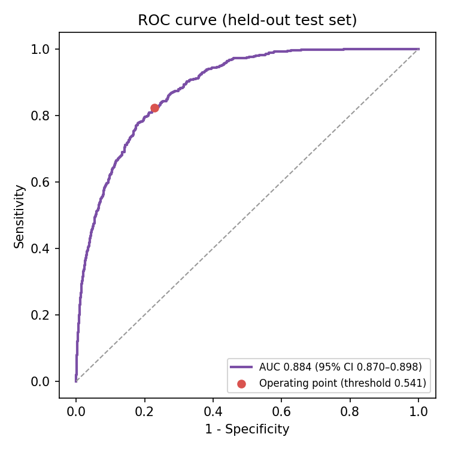

# モデルカード: 胸部X線 肺炎スクリーニングモデル

> ⚠️ **研究・学習目的のモデルです。** 医療機器としての承認・認証は受けておらず、診断や治療方針の決定に使用することはできません。

| 項目 | 内容 |
|---|---|
| モデル名 | `efficientnet_b0`（MyDicomViewer 肺炎スクリーニング） |
| バージョン | 1.0（2026年10月） |
| 形式 | ONNX（opset 17）。出力: 肺炎所見の確率 `prob` と Grad-CAM ヒートマップ `cam` |
| 実行環境 | ONNX Runtime（CPU）。外部への通信なしで PC 内で完結 |
| 作成者 | 髙橋 春喜 |

## 1. 想定する用途

- 胸部X線（正面像、CR / DX）に対して、肺炎を示唆する所見がある確率を推定し、AI が判断の根拠とした領域をヒートマップで示す
- **教育・研究・技術デモ**（医療画像 AI の仕組みの学習、ビューアへの AI 組み込みの実証）

### 想定しない用途

- 診断、トリアージ（優先順位付け）、治療方針の決定など、臨床上の判断
- 胸部X線以外の画像（CT、MRI、側面像、小児の画像など）。アプリはモダリティが CR / DX 以外の場合に警告する
- 肺炎以外の疾患の検出。「陰性」は「異常がない」ことを意味しない

## 2. 学習データ

- **RSNA Pneumonia Detection Challenge**（Kaggle, 2018）の学習用データ 26,684 人分
  - 元画像は NIH ChestX-ray14、肺炎所見の注釈は RSNA と胸部放射線学会（STR）の放射線科医による
  - ラベル: 「肺炎を示唆する陰影（Lung Opacity）」があれば陽性（約 22%）
- 患者単位で 学習 80% / 検証 10% / テスト 10% に分割（同じ患者が複数の分割に入らない）
- データはコンペのルール（学術研究・教育を含む利用を許可、帰属表示が必要、参加者以外への公開・再配布は禁止）に従って使用し、画像・注釈は再配布していない
- 引用: Anouk Stein, MD, Carol Wu, Chris Carr, George Shih, Jamie Dulkowski, kalpathy, Leon Chen, Luciano Prevedello, Marc Kohli, MD, Mark McDonald, Peter, Phil Culliton, Safwan Halabi MD, and Tian Xia. RSNA Pneumonia Detection Challenge. https://www.kaggle.com/competitions/rsna-pneumonia-detection-challenge, 2018. Kaggle.

## 3. 学習方法

- ImageNet で事前学習した EfficientNet-B0 を転移学習（224×224、グレースケールを3チャネルに複製）
- 前処理: Rescale 適用 → MONOCHROME1 反転 → 画像全体の min-max 正規化 → 面積平均で縮小
  - アプリ（C#）でも同じ手順を実装し、同じ画像で確率が一致することを確認
- クラス不均衡は損失関数の重み（pos_weight）で補正。8 エポック、AdamW、コサイン減衰
- 判定閾値は**検証データ**で感度＋特異度が最大になる値（0.541）に決め、テストデータには調整せずに適用

## 4. 評価結果（テストデータ: 学習・閾値決定に一度も使っていない 2,669 人）

### 分類性能

| 指標 | 値 |
|---|---|
| AUC | **0.884**（95% 信頼区間 0.870–0.898、ブートストラップ法 1,000 回） |
| 感度 | 82.4% |
| 特異度 | 77.2% |
| 正解率 | 78.3% |
| 陽性的中率（PPV） | 51.2% |
| 陰性的中率（NPV） | 93.8% |
| 推論時間（CPU） | 約 43 ms / 枚 |

アプリに組み込んだ **ONNX モデルそのもの** で評価しており、学習時（PyTorch）の AUC と一致したことから、変換による性能の低下はない。

### 判断根拠の位置の妥当性（陽性画像のうち、放射線科医が病変の枠を付けたもの）

| 指標 | 値 | ランダムな場合 |
|---|---|---|
| Pointing Game（ヒートマップの最大点が病変の枠内にある割合） | **73.2%** | 11.8% |
| Energy Ratio（ヒートマップの総量のうち枠内にある割合） | **30.5%** | 11.8% |

対象は陽性かつ病変の枠が付いた 601 枚。「ランダムな場合」は枠が画像に占める面積の割合で、ヒートマップの位置が偶然だった場合の期待値にあたる。
最も強く反応した点は約 7 割が病変の枠内にあり偶然の約 6 倍だが、ヒートマップ全体のうち枠内にあるのは約 3 割にとどまり、病変以外の領域にも広く反応している。

評価方法は [pneumonia-ai/evaluate.py](../pneumonia-ai/evaluate.py) を参照。

## 5. 既知の限界とリスク

- **単一のデータセットのみで学習・評価している。** 撮影装置・施設・人種構成・年齢層が異なるデータ（日本の医療機関の画像など）での性能は検証していない
- **ラベルの曖昧さ。** 「肺炎を示唆する陰影」には無気肺や胸水などとの区別が難しい例が含まれ、ラベル自体に揺らぎがある
- **陽性の約 2 割を見逃し、陰性の約 2 割を誤って陽性とする**（上記の感度・特異度）。陽性率約 22% のテストデータでも陽性判定の約半数は偽陽性（PPV 51.2%）で、有病率がより低い集団ではさらに偽陽性の割合が増える
- **ヒートマップは「根拠の候補」にすぎない。** 肺野の外（腹部、カテーテル、文字マーカーなど）に反応することがあり、モデルが医学的に正しい理由で判断していることを保証しない
- 解像度を 224×224 に縮小するため、小さな病変は捉えにくい
- 前処理（min-max 正規化）は画像全体の最小・最大値に依存するため、極端な値の画素（金属・文字の焼き込み）が多い画像では見え方が変わる

## 6. 安全のための設計

- アプリ上で常に「研究・学習目的、診断には使用不可」と表示
- CR / DX 以外の画像では実行前に警告
- **陰性と判定した場合は、ヒートマップを既定で表示しない。** Grad-CAM は画像内で相対的に強く反応した場所を示すため、陰性の画像でも必ずどこかが赤くなり、所見の位置と誤解されるおそれがある（利用者が明示的に選んだ場合のみ表示）
- 推論は PC 内で完結し、画像を外部に送信しない
- 結果を DICOM として保存する場合、画像のコメント欄に確率・閾値・モデル名と「Research use only - not for diagnosis」を記録し、どの元画像から作ったかを参照情報（Source Image Sequence）として残す

## 7. 今後の改善

- 複数施設・複数装置のデータでの外部検証
- 肺野セグメンテーションと組み合わせ、肺野外への反応を抑える
- 確率の較正（Calibration）と、信頼区間・不確実性の表示
- 病変の位置検出（バウンディングボックス）への拡張
